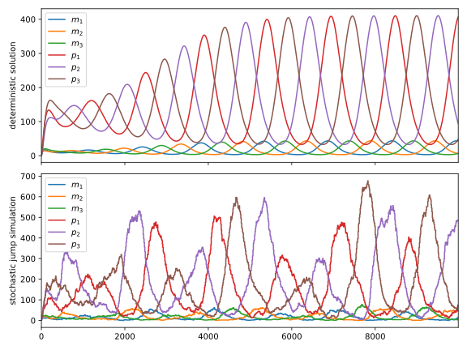

# Linear-Hill SSA



<!-- @import "[TOC]" {cmd="toc" depthFrom=2 depthTo=6 orderedList=false} -->

<!-- code_chunk_output -->

- [Introduction](#introduction)
  - [Installation](#installation)
  - [Features / TO DO](#features-to-do)
- [Tutorial and Examples](#tutorial-and-examples)

<!-- /code_chunk_output -->


## Introduction

This is an implementation of the Gillespie Stochastic Simulation Algorithm (SSA) for pure jump Markov processes, using a matrix notation approach for the model input. 

This notation limits the type of reactions of the system; only linear combinations, constant terms and Hill rate terms of the state variables are allowed in the propensities. The generalization to second order terms is straigthfoward, but I think it should be a separate package due to the performance overhead, as not all systems would use the higher order terms. Maybe.

There should be, however, an overhead on this implementation due to the extensive use of matrix multiplications, as the size of the matrices involved are typically $(S,2S)$, where $S$ is the number of state variables. This is a sacrifice for generality, which is the purpose of this library. Some use cases benefit gratly from this, as the language allows for easy procedural generation of long genetic expression chain circuits, as can be seen below.

The goal of this project is to provide a FORTRAN 90 library and a Python wrapper to call it without having to write a single FORTAN line of code.

### Installation

Dpendencies:

* `numpy >= 1.13.0`
* `scipy >= 1.8.0`

Clone this repository and run
```bash
pip install .
```

If necessary, the fortran bindings can be recreated using
```bash
f2py --f90flags="-Ofast" -c LinearHillSSA.f90 -m ssa 
```


### Features / TO DO

- [x] **Simulation functions**: given a model, build functions to directly simulate:
    
    - [x] Raw stochastic simulation, with exponentially distributed time differences, given iteration number.
    
    - [x] Time-regularized simulation of one system, given sampling times.
    
    - [x] Time regularized ensemble simulation, with both individual and ensemble initial conditions, given sampling times.

- [x] **Fortran bindings**: We can use the magical `numpy.f2py` to compile the fortran code into an usable CPython module. This module is awkward to use directly, and it is almost undocumented, so interface python functions have to be written.

- [x] **Model library**: As described below, the generalized way of defining systems used in this library makes it easy to generate long chains.

- [x] **Deterministic interface**: It should not be difficult to generate the functions neccesary to run the system on `scipy.integrate.solve_ivp` to obtain the non-stochastic solution of the differential equations. 

    - [x] **Steady state solutions**: Once we have a dertministic system, passing it to `scipy.optimize.root` would give the stationary state result... or at least one of them. 

- [ ] **Documentation and examples**: I'm sorry, have patience.

- [ ] **Sparse support**: This implementation could be greatly optimized with the use of sparse arrays, as the matrices used to define the model should have a lot of zeroes. Doing so is a delight in Julia, but a nightmare in Fortran/SciPy, so that will have to wait.

- [ ] **Second order terms**: The Lotka-Volterra and SIR systems are second order at most, and those are the next logical steps to expand the library. For $S$ state variables, there are $\frac12(S^2+S)$ mixed second order terms. This could greatly impact the performance on first order systems, so additional simulation functions would need to be crated to include those.


## Tutorial and Examples

For the model notation description, examples and more, head to the [user guide](doc/user_guide.pdf).

